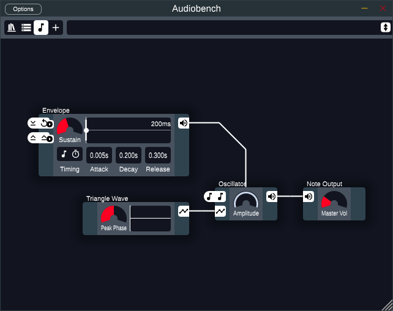
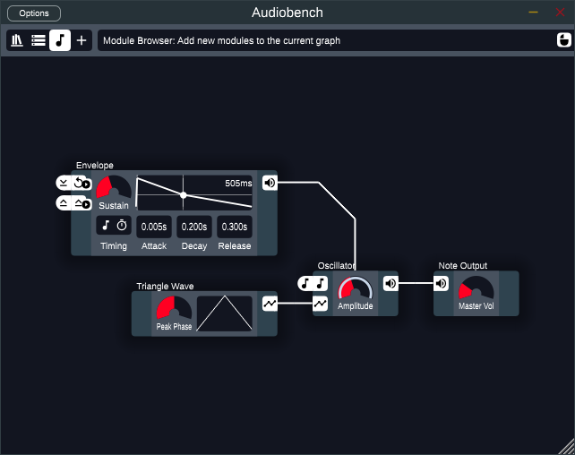
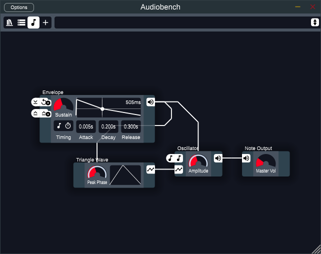
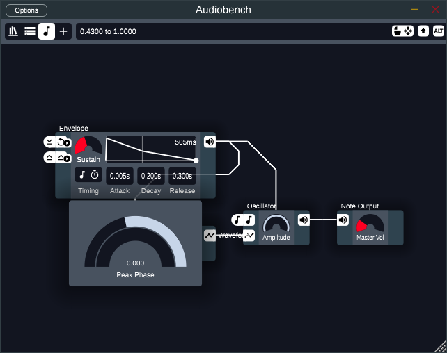
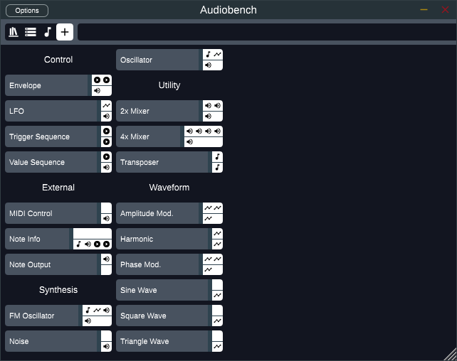
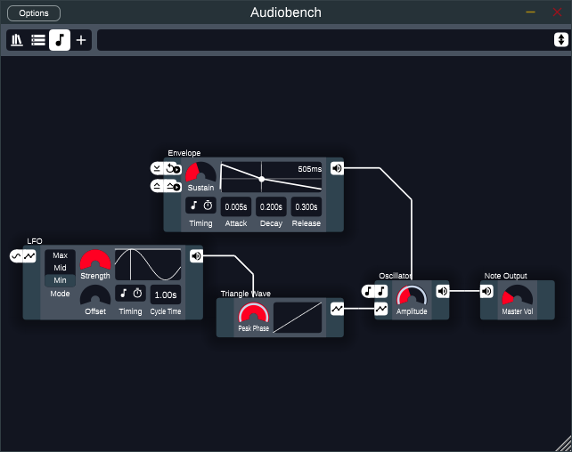

# Getting Started

When you first open Audiobench, you should see something like this:



The main area of the window shown here is called the "note graph", it is where
you can connect modules together to design your sounds. The large bar at the top
will show tooltips describing whatever item you are hovering over as well as the
different ways you can interact with it, such as right click or left click and
drag. The icons at the top left cycle between different interfaces. Hovering
over them will show a tooltip describing their function. If anything appears too
small, you can resize the window to make it bigger.

This simple default patch already contains all the concepts you need to know to
get started making sounds with Audiobench. The patch is made of four 
**modules**, each showing their name above them. Each module has **controls**
that change their behavior. The modules are connected together through 
**wires**. All told, this patch makes a simple "ding" sound. Playing a note
will reveal how the modules affect each other:



The *amplitude* (also known as volume) of the oscillator module is being
affected by the wire coming from the envelope module. We say that the
*amplitude* control is **automated** by the output from the envelope. If you
change some of the controls on the envelope by clicking and dragging them, you
change how the *amplitude* of the oscillator changes over time. The only
controls that can be automated are **knobs** and **sliders**. You can automate
them by dragging a wire from an output onto a knob or slider. One way to make
this patch more interesting is by making the envelope automate the *peak phase*
control on the triangle wave module:



You may have noticed while setting that up that the audio cut out and a
notification saying "compiling" appeared. Because of how Audiobench works
internally, some changes necessitate doing a slow, one-time process called
"compilation" before you can start playing notes again. This process will not
occur whenever you modify a control. Right now compilation is fairly slow, this
will be improved as development continues.

You can change the range of the automation by right-clicking on the knob and
clicking and dragging on the **automation lane**. You can also right-click on
the lane itself to remove its automation from the control.



The last thing to talk about is **inputs** and **outputs**. These are the white
boxes that appear on the sides of each module. Inputs are on the left and
outputs are on the right. Each of them has a specific type, so that pitch inputs
can only be connected to pitch outputs, waveform inputs can only be connected to
waveform outputs, and so on. Audio outputs are special because they also allows
you to automate knobs and sliders in addition to connecting to audio inputs.
When an input is not connected, it uses a default value instead. If you hover
over the envelope module, you will notice it says that the input to reset the
envelope uses the default value of whenever the note starts, and the input to
release it uses whenever the note releases. Similarly, the pitch of the
oscillator defaults to the pitch of the note you are currently playing. Clicking
on an unconnected input will cycle between different default values. For
example, disconnecting the triangle wave from the oscillator would let you cycle
through a handful of default waveforms. Inputs and outputs can be connected by
clicking and dragging.

# Beyond The Default Patch
To really start making some noise, you'll want to add in more modules, The plus
button at the top left of the screen takes you to the **module browser**, which
lists all available modules:



Clicking on one will add it to the note graph. You can click and drag the module
to move it around, or click and drag on the background to pan your view.
Scrolling on the background will zoom in and out to help with building larger
patches.



Once you have something you like, go to the patch browser by clicking its icon
in the top-left corner. This is where all the factory-provided and user-made
patches live. To save your patch, first click the '+' button to make a new file.
Give it a name, then click the save button to save your changes. If you want to
easily share your patch with other people, click the copy button to get a piece
of text that represents your patch. Others can then copy that text and click the
paste button to load your patch. You can try it out with this code for the
patch in the picture above:

```
AQAHRGVmYXVsdAAAAQAE_wHgAKgFAVAAqAYAeADACgAwADAOIgABAliAAGqqAAA7o9cKAD5MzM0APpmZmgMD
```

# Miscellaneous Tips
- Right-clicking a duration control lets you adjust it as a fraction instead of
  a number.
- The timing control lets you set if durations should be in terms of beats or
  seconds and also lets you sync up certain modules with the current time in
  your song.
- Using a MIDI Control module with the control set to 1 will let you automate
  things using the mod wheel.
- The library browser panel (the first icon in the top-left) will tell you what
  new features are available if a new version of Audiobench has been released.
